# 🛍️ Raqsa – Smart Inventory E-Commerce Platform

<p align="center">
  
  
  
  
  
  
</p>

<p align="center">
A modern <strong>MERN Stack E-Commerce Platform</strong> featuring secure authentication, smart inventory management, Stripe payments, and a responsive user experience.
</p>

---

# 📖 Table of Contents

- [Overview](#-overview)
- [Demo](#-demo)
- [Features](#-features)
- [Tech Stack](#-tech-stack)
- [Architecture](#-architecture)
- [Project Structure](#-project-structure)
- [Screenshots](#-screenshots)
- [Getting Started](#-getting-started)
- [Environment Variables](#-environment-variables)
- [API Overview](#-api-overview)
- [Security Features](#-security-features)
- [Future Enhancements](#-future-enhancements)
- [Contributing](#-contributing)
- [License](#-license)

---

# 📖 Overview

**Raqsa** is a full-stack MERN (MongoDB, Express.js, React.js, Node.js) e-commerce web application developed as a comprehensive software engineering project.

The platform provides customers with a seamless online shopping experience while enabling administrators to manage products, categories, orders, and inventory efficiently.

One of the key highlights of the project is its **Smart Inventory Management System**, which helps monitor stock levels and simplifies inventory management.

---

# 🚀 Demo

> **Live Demo:** *(Coming Soon)*

---

# ✨ Features

## 👤 User Authentication

- User Registration
- Secure Login
- JWT Authentication
- Protected Routes
- User Profile Management

---

## 🛍 Shopping

- Browse Products
- Product Categories
- Product Details
- Search Products
- Shopping Cart
- Quantity Management
- Checkout Process

---

## 💳 Payment

- Stripe Payment Gateway
- Secure Checkout
- Payment Confirmation

---

## 📦 Inventory Management

- Smart Inventory Tracking
- Product Management
- Category Management
- Stock Updates
- Low Stock Monitoring

---

## 📑 Order Management

- Place Orders
- View Order History
- Order Details

---

## 🎨 User Experience

- Responsive Design
- Clean UI
- Mobile Friendly
- Fast Navigation
- Modern Layout

---

# 🛠 Tech Stack

## Frontend

- React.js
- Vite
- Tailwind CSS
- React Router
- Axios

## Backend

- Node.js
- Express.js
- JWT Authentication
- REST APIs

## Database

- MongoDB
- Mongoose

## Payment

- Stripe

## Tools

- Git
- GitHub
- Postman
- VS Code

---

# 🏗 Architecture

```
                Client (React)
                      │
             Axios REST API Calls
                      │
             Express.js Server
                      │
     ┌────────────────┴────────────────┐
     │                                 │
 Authentication                 Business Logic
     │                                 │
 JWT Middleware                 Controllers
     │                                 │
     └────────────────┬────────────────┘
                      │
                  MongoDB
```

---

# 📂 Project Structure

```
Raqsa-Smart-Inventory
│
├── frontend
│   ├── node_modules
│   ├── public
│   │   ├── images
│   ├── src
│   │   ├── assets
│   │   ├── Components
│   │   ├── pages
│   │   ├── Context
│   │   ├── api
│   │   └── App.jsx
│   └── package.json
│
├── backend
│   ├── config
│   ├── controllers
│   ├── middleware
│   ├── models
│   ├── node_modules
│   ├── routes
│   ├── uploads
│   ├── utils
│   ├── server.js
│   └── package.json
│
├── screenshots
│
├── README.md
│
└── LICENSE
```

---

# 📸 Screenshots

## 🏠 Home Page

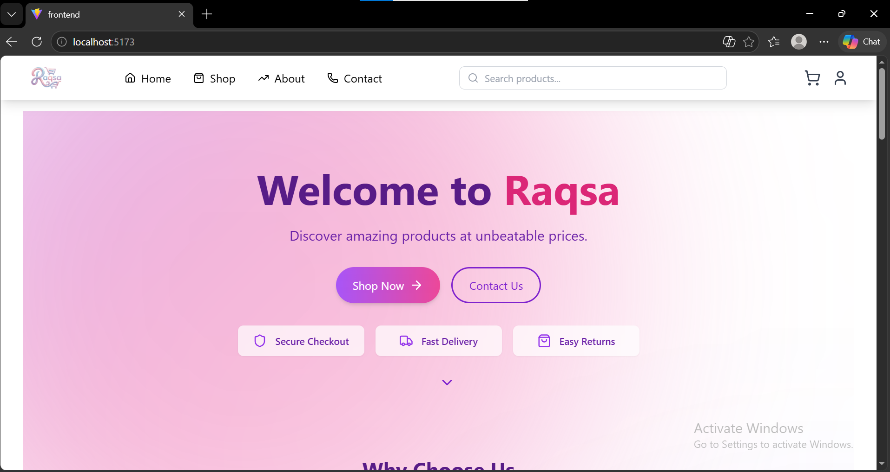

---

## 🛒 Shop Page

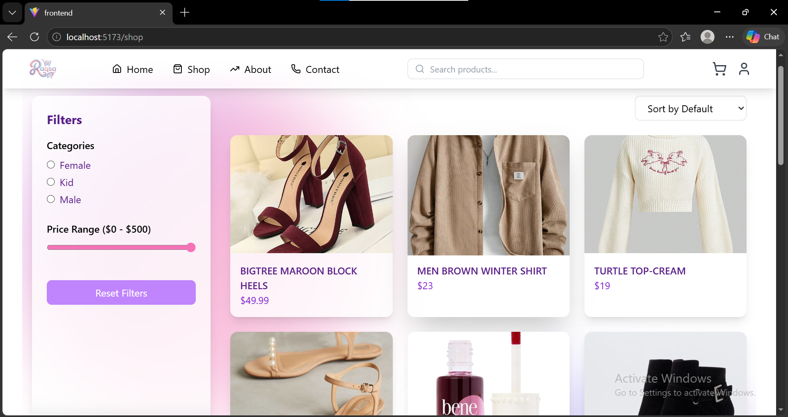

---

## 📦 Product Details

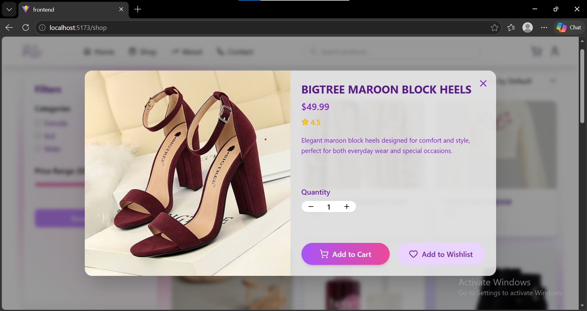

---

## 🛍️ Shopping Cart

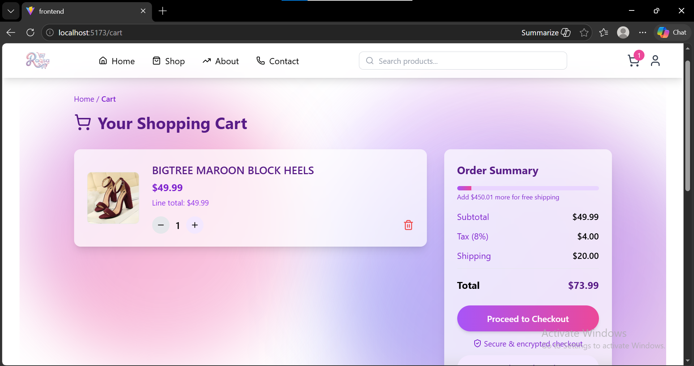

---

## ❤️ Wishlist

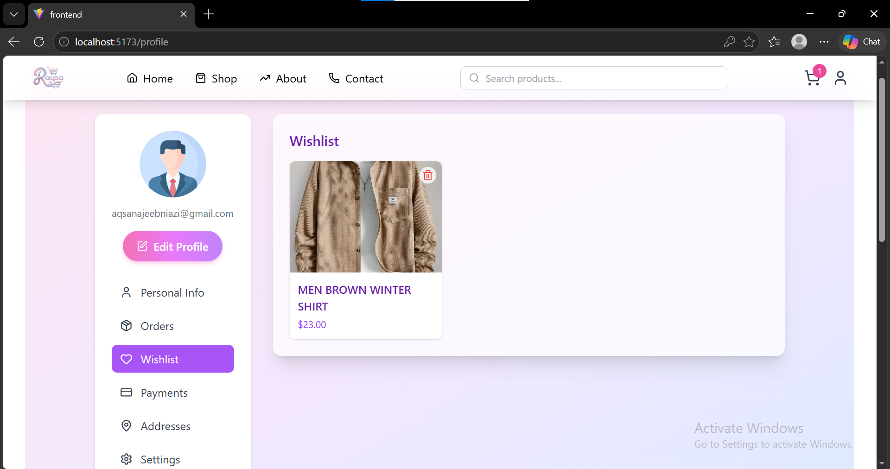

---

## 💳 Checkout

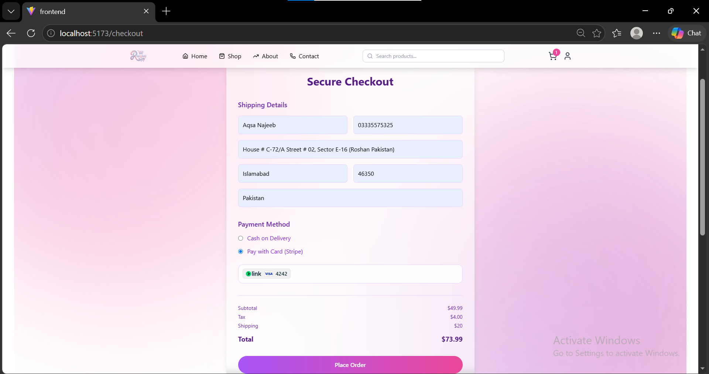

---

## 👤 User Profile

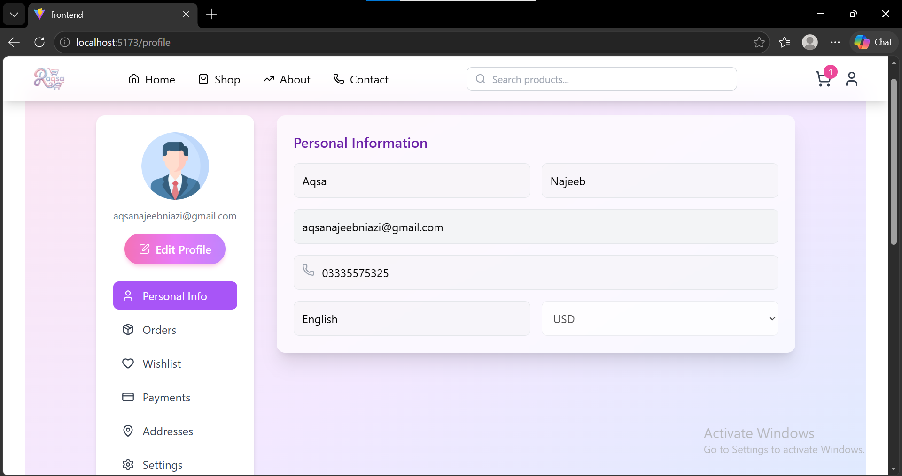

---

## 🏪 Vendor Dashboard

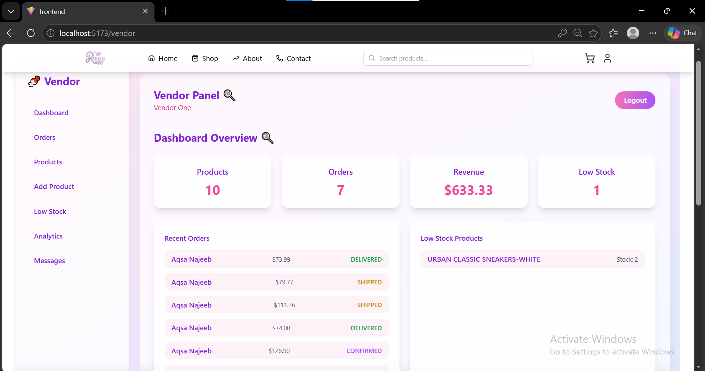

---

## 📋 Orders

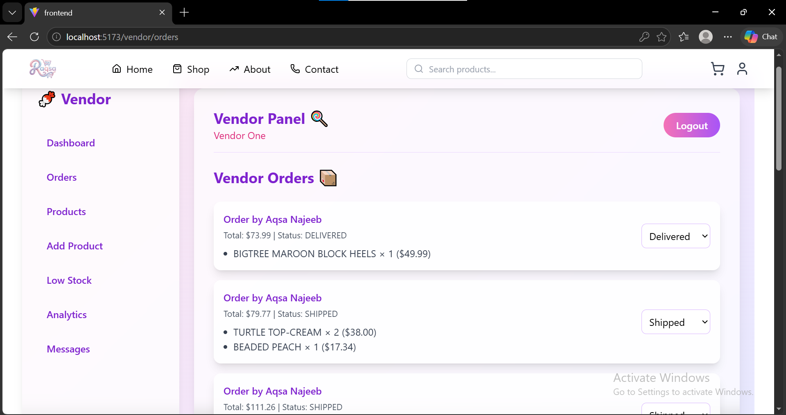

---

## 📦 My Products

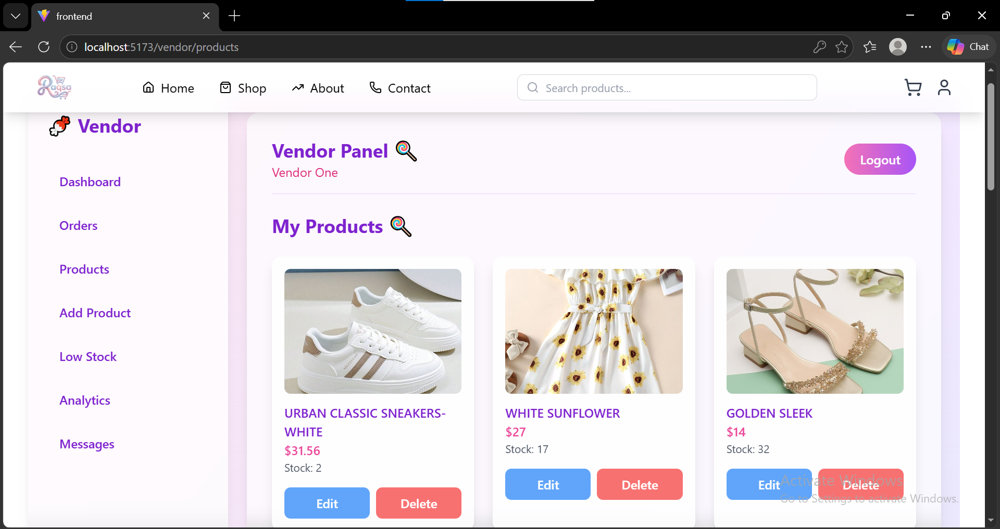

---

## 💬 Messages

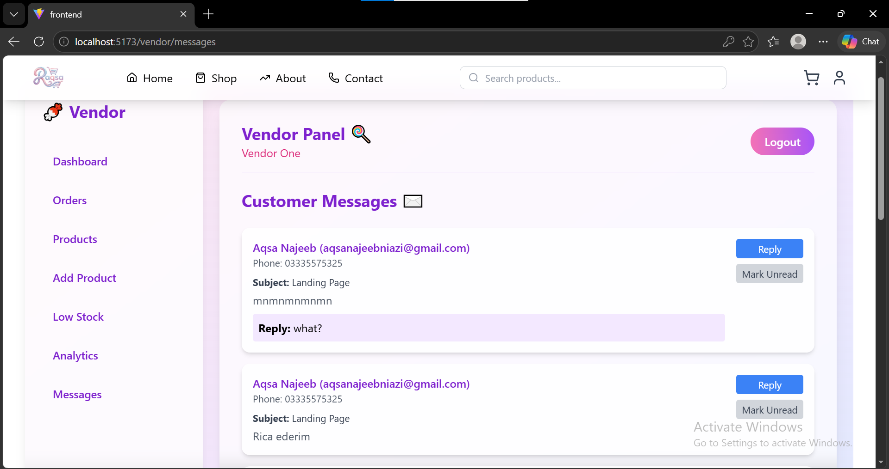

---

## ⚠️ Low Stock

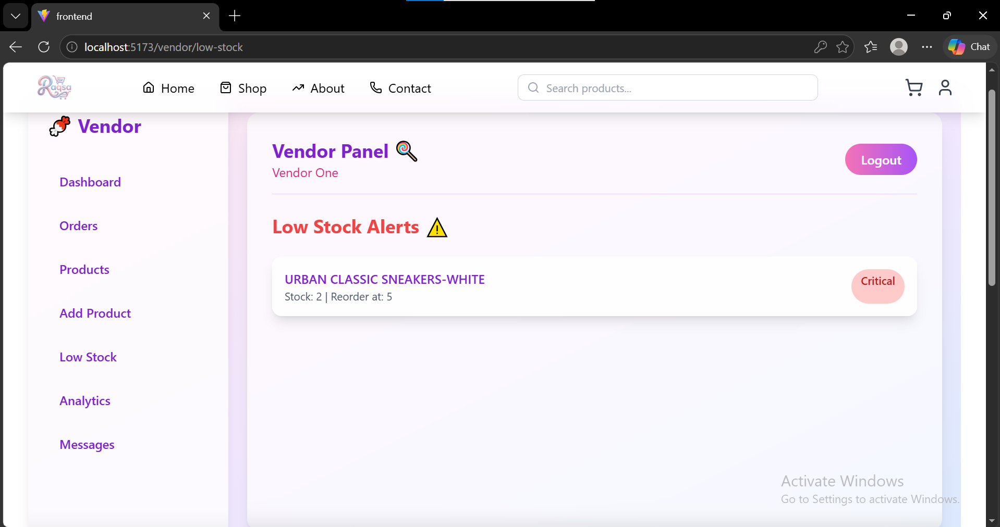

---

## 📊 Analytics & Insights

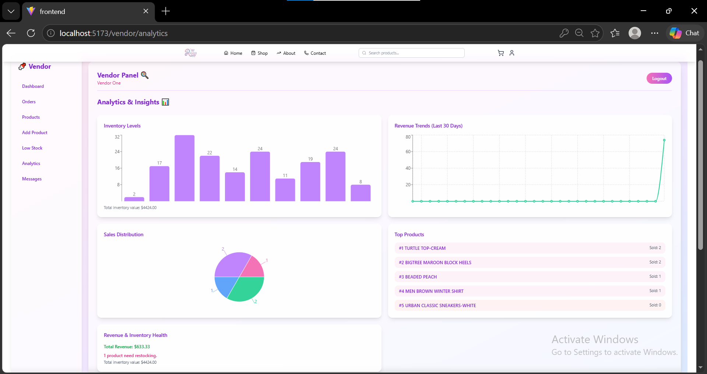

---

# ⚙ Getting Started

## Clone Repository

```bash
git clone https://github.com/AqsaNajeeb/Raqsa-Smart-Inventory.git
```

---

## Navigate to Project

```bash
cd Raqsa-Smart-Inventory
```

---

## Install Frontend Dependencies

```bash
cd frontend
npm install
```

Run Frontend

```bash
npm run dev
```

---

## Install Backend Dependencies

```bash
cd backend
npm install
```

Run Backend

```bash
npm run dev
```

---

# 🔐 Environment Variables

Create a `.env` file inside the backend folder.

```env
PORT=5000

MONGO_URI=your_mongodb_connection_string

JWT_SECRET=your_jwt_secret

STRIPE_SECRET_KEY=your_stripe_secret_key

STRIPE_PUBLISHABLE_KEY=your_stripe_publishable_key
```

---

# 🌐 API Overview

## Authentication

- POST `/api/auth/register`
- POST `/api/auth/login`

---

## Products

- GET `/api/products`
- GET `/api/products/:id`
- POST `/api/products`
- PUT `/api/products/:id`
- DELETE `/api/products/:id`

---

## Categories

- GET `/api/categories`
- POST `/api/categories`

---

## Cart

- GET `/api/cart`
- POST `/api/cart`
- DELETE `/api/cart/:id`

---

## Orders

- GET `/api/orders`
- POST `/api/orders`

---

## Payments

- POST `/api/payments/create-payment-intent`

---

# 🔒 Security Features

- JWT Authentication
- Protected API Routes
- Password Encryption
- Secure Stripe Payment Processing
- Environment Variables
- RESTful API Design

---

# 🌟 Project Highlights

- Full Stack MERN Application
- Smart Inventory Management
- Stripe Payment Integration
- Secure Authentication
- Responsive User Interface
- RESTful API Architecture
- Modular Code Structure
- Scalable Design

---

# 🚀 Future Enhancements

- Product Reviews & Ratings
- AI Product Recommendations
- Order Tracking
- Coupon System
- Multi-Vendor Marketplace
- Admin Dashboard Enhancements
- Dark Mode

---

# 🤝 Contributing

Contributions are welcome.

1. Fork the repository.
2. Create a new feature branch.
3. Commit your changes.
4. Push the branch.
5. Open a Pull Request.

---

# 👩‍💻 Author

## Aqsa Najeeb

**Software Engineering Undergraduate**

- MERN Stack Developer
- Machine Learning Enthusiast
- Passionate about building scalable web applications

### GitHub

https://github.com/AqsaNajeeb

### LinkedIn

https://www.linkedin.com/in/aqsa-najeeb/

---

# ⭐ Show Your Support

If you found this project helpful, consider giving it a ⭐ on GitHub.

---

# 📄 License

This project is licensed under the MIT License.

---

<p align="center">
Made with ❤️ using the MERN Stack.
</p>
